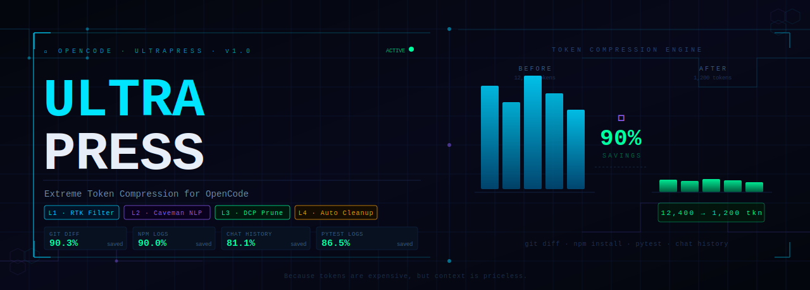
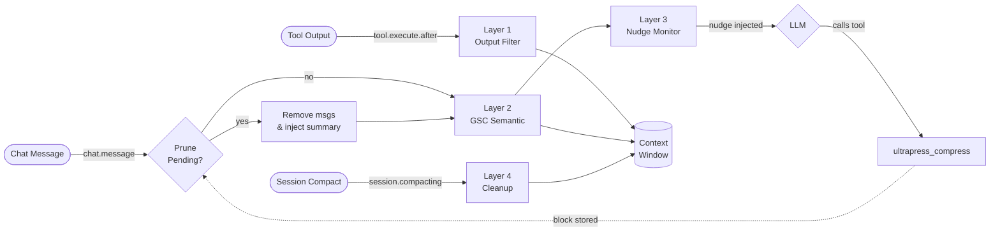

<p align="center">
  
</p>

<div align="center">

# 🚀 OpenCode UltraPress

**Token Compression Plugin for OpenCode AI**

[](https://github.com/rahadiana/opencode-ultrapress/actions/workflows/ci.yml)
[](https://www.npmjs.com/package/@rahadiana/opencode-ultrapress)
[](https://opensource.org/licenses/MIT)

</div>

> **UltraPress** saves context window tokens through 4 compression layers that run automatically in the background — from CLI output filtering, semantic compression, dynamic context pruning, to auto-cleanup. Your LLM stays smart, tokens stay lean.

---

## 📑 Table of Contents

- [⚡ Installation & Setup](#-installation--setup)
  - [System Requirements](#system-requirements)
  - [Install from GitHub](#1-install-the-plugin)
  - [Register to OpenCode](#2-register-to-opencode)
  - [Personal Configuration](#3-optional-create-personal-configuration)
  - [Verify Installation](#verify-installation)
  - [Uninstall](#uninstall)
- [🛠 4-Layer Architecture](#-4-layer-architecture)
  - [Pipeline Flow](#pipeline-flow)
  - [Layer 1 — Smart Output Filter](#layer-1--smart-output-filter)
  - [Layer 2 — GSC Semantic Compression](#layer-2--gsc-semantic-compression)
  - [Layer 3 — Dynamic Context Pruning (DCP)](#layer-3--dynamic-context-pruning-dcp)
  - [Layer 4 — Session Auto-Cleanup](#layer-4--session-auto-cleanup)
- [⚙️ Configuration](#️-configuration)
  - [Full documentation →](./docs/konfigurasi-lengkap.md)
- [⌨️ `/up` Slash Command](#️-up-slash-command)
  - [Sub-command List](#sub-command-list)
  - [Example Output](#example-output)
- [❷ MLM & NLP Support](#-mlm--nlp-support)
  - [NLP Mode (Default)](#nlp-mode-default)
  - [MLM Mode (Experimental)](#mlm-mode-experimental)
  - [Mode Comparison](#mode-comparison)
- [🏗 Code Architecture](#-code-architecture)
  - [Directory Structure](#directory-structure)
  - [Hook Registration Map](#hook-registration-map)
  - [Data Flow Detail](#data-flow-detail)
- [🧪 Testing](#-testing)
- [📊 Benchmark](#-benchmark)
- [🚀 Local Development](#-local-development)
- [❓ FAQ & Troubleshooting](#-faq--troubleshooting)
- [🗺 Roadmap](#-roadmap)
- [🤝 Contributing](#-contributing)
- [📝 Changelog](#-changelog)
- [📄 License](#-license)

---

## ⚡ Installation & Setup

### System Requirements

| Dependency | Minimum Version | Notes |
| :--- | :--- | :--- |
| **Node.js** | `>= 18` | Node 22 LTS recommended |
| **OpenCode AI** | Latest | Uses `@opencode-ai/plugin ^1.14` |
| **Git** | Any | Required for GitHub install |
| **Bun** | Latest | For development/testing only |
| **@huggingface/transformers** | Auto-install | Only used when `mlm` mode is active |

### 1. Install the Plugin

```bash
# From npm (recommended)
npm install -g @rahadiana/opencode-ultrapress

# Or from GitHub (latest development)
npm install -g github:rahadiana/opencode-ultrapress

# Or clone & link manually
git clone https://github.com/rahadiana/opencode-ultrapress.git
cd opencode-ultrapress
npm install && npm run build && npm link
```

### 2. Register to OpenCode

Add the plugin to the OpenCode configuration file at `~/.config/opencode/config.json`:

```json
{
  "plugins": ["@rahadiana/opencode-ultrapress"]
}
```

> 💡 **Tip**: OpenCode will auto-resolve globally installed plugins via the `@opencode-ai/plugin` runtime. Restart OpenCode after adding the plugin.

### 3. (Optional) Create Personal Configuration

UltraPress works out-of-the-box with sensible defaults. For customization:

```bash
# Install from GitHub → copy from the cloned repo
cp ultrapress.jsonc.example ~/.config/opencode/ultrapress.json

# Or from global install
cp $(npm root -g)/@rahadiana/opencode-ultrapress/ultrapress.json.example ~/.config/opencode/ultrapress.json
```

Then edit `~/.config/opencode/ultrapress.json` as needed. If the file is not found, UltraPress will automatically create it with default values on first run.

### Verify Installation

After restarting OpenCode, type in chat:

```
/up stats
```

If a statistics dashboard appears, UltraPress is active. If not:
1. Ensure the plugin is in `config.json` → `"plugins": ["@rahadiana/opencode-ultrapress"]`
2. Check OpenCode logs for errors
3. Ensure Node.js >= 18 is installed (`node --version`)

### Uninstall

```bash
# If installed from GitHub (global)
npm uninstall -g @rahadiana/opencode-ultrapress

# If using npm link
npm unlink -g @rahadiana/opencode-ultrapress

# Clean up config
rm ~/.config/opencode/ultrapress.json
```

---

## 🛠 4-Layer Architecture

UltraPress intercepts OpenCode message flow at 4 different points, each with a specific compression strategy.

### Pipeline Flow



---

### Layer 1 — Smart Output Filter

> **Hook**: `tool.execute.after` · **File**: `layer1-output-filter.ts` · **Filters**: `src/filters/`

Intercepts CLI tool output **before** it enters the context window. The most aggressive layer — directly cuts unnecessary logs.

**Core Strategies:**

| Strategy | Description |
| :--- | :--- |
| **Domain Routing** | Each CLI tool is routed to a specific filter: `git`, `npm/node`, `pytest/jest`, and filesystem. Unknown tools go to the generic filter. |
| **Middle-out Truncation** | Truncates logs from the middle, preserving the beginning (context) and end (error/result). Smarter than head/tail truncation. |
| **Deduplication** | Removes identical repeated log lines in real-time. Very effective for build & test logs. |
| **Tee Save** | If output is truncated, the original log is saved to a temporary `.log` file so it can still be accessed if needed. |

**Built-in Filters:**

| Filter | File | Trigger Tools |
| :--- | :--- | :--- |
| **Git** | `filters/git.ts` | `git diff`, `git log`, `git show` — remove redundant diff hunks, keep summary |
| **Test** | `filters/test.ts` | `pytest`, `jest`, `vitest`, `mocha` — summarize failure output, remove passing tests |
| **Bash** | `filters/bash.ts` | Generic shell output — dedup lines, middle-out truncation |
| **Filesystem** | `filters/fs.ts` | `ls`, `cat`, `find` — limit file count, truncate long content |
| **Generic** | `filters/generic.ts` | Fallback for all other tools — middle-out truncation + dedup |

---

### Layer 2 — GSC Semantic Compression

> **Hook**: `chat.message` · **File**: `layer2-caveman.ts` · **Engine**: `src/caveman/`

Compresses message text **semantically** — removes unimportant words without changing meaning. Layer 2 and Layer 3 **do not compress each other** — no double compression.

**Compression Rules:**

- Conjunctions (`that`, `and`, `will`, `which`) → removed
- Excessive pronouns → condensed
- Redundancy ("I think I will" → "I will") → removed
- Double spaces, unnecessary whitespace → normalized
- **Code blocks** (inside ` ``` `) → **NEVER** touched
- **Error messages & stack traces** → fully protected
- Messages < 200 characters → skipped

**Operating Modes:**

See [❷ MLM & NLP Support](#-mlm--nlp-support) for detailed NLP vs MLM comparison.

---

### Layer 3 — Dynamic Context Pruning (DCP)

> **Hook**: `chat.message` (pruning) + `tool.execute.after` (compress tool) · **File**: `layer3-dcp.ts` · **Engine**: `src/dcp/`

The most advanced system: **gives LLM autonomy to manage its own memory**. Unlike Layer 2 which only compresses text, Layer 3 **actually removes old messages from the context window** and replaces them with summaries.

**Mechanism:**

```
1. Context Monitor → detect tokens approaching maxContextLimit
2. Autonomous Nudge → inject prompt into user message: "context window nearly full, call ultrapress_compress"
3. LLM calls → ultrapress_compress(mode="range", from=<id>, to=<id>)
4. Compression Block → stored in memory (compress-state.ts)
5. chat.message hook → check pending blocks → remove messages in range → inject summary as synthetic message
```

**Key Features:**

| Feature | Description |
| :--- | :--- |
| **Block-based Pruning** | When `ultrapress_compress` is called, LLM determines the message range to summarize. Block is stored, then executed on the **next** chat (not current — avoids race condition). |
| **prune via `chat.message` Hook** | Each new message → plugin checks pending blocks → removes messages in range from context array → injects summary. |
| **Protected Content** | Important tool output (`task`, `write`, `edit`, `bash` success results, `read`) is protected from pruning. Only `read` output is filtered. See `protected-content.ts`. |
| **Nesting Support** | Compression can be done on top of previous compression. Nested summaries are auto-merged. |
| **`preserveLastN`** | Protects the **last** N messages from pruning — keeps recent conversation context intact. Default: `3`. Set to `0` to disable. |
| **Multi-Signal Scoring** | In addition to `preserveLastN`, each message is scored from 5 signals (recency, role, tool type, keyword, content size). High-scoring messages are preserved even in old blocks. Default: off (`scoreThreshold: 0`), recommended: `0.45`. |
| **Reversible Compression** | `ultrapress_expand` tool — LLM can "expand" previously summarized blocks to see the original content. Original content is stored in plugin memory (not in LLM context). |
| **Nudge @70%** | Nudge is sent when context reaches 70% limit (not 100%), giving LLM time to compress before context is truly full. |
| **summaryBuffer** | After pruning, provides breathing room (no immediate re-nudge). |

**Two Pruning Modes:**

| Mode | Description |
| :--- | :--- |
| `range` | Range-based compression: choose from_id and to_id. All messages in between are summarized into one. |
| `message` | Surgical compression: choose one or more specific message IDs to summarize. |

---

### Layer 4 — Session Auto-Cleanup

> **Hook**: `tool.execute.after` + `session.compacting` · **File**: `layer4-cleanup.ts`

Automatically cleans "garbage" from the context window.

**Features:**

| Feature | Description |
| :--- | :--- |
| **Error Purging** | Removes error/failed tool messages after N chat turns (default: 4 turns). Stale errors only waste tokens. |
| **Tool-Call Dedup** | Prevents LLM from repeating identical tool calls (same tool + args) in the same session. |

---

## ⚙️ Configuration

> 📖 **Full configuration documentation** (all keys, types, defaults, examples, presets, custom filters, troubleshooting) at:
> [`docs/konfigurasi-lengkap.md`](./docs/konfigurasi-lengkap.md)

### Basic Structure

File: `~/.config/opencode/ultrapress.json`

```jsonc
{
  "enabled": true,           // Master switch
  "notification": "minimal", // "off" | "minimal" | "detailed"
  "autoUpdate": true,        // Auto-update from npm

      "outputFilter": {},
      "semantic": {},
      "summarization": {},
      "cleanup": {}
}
```

| Layer | Key | Function |
| :--- | :--- | :--- |
| **L1** | `outputFilter` | Limit CLI output length, filter repetitive lines |
| **L2** | `semantic` | NLP/MLM text compression without destroying meaning |
| **L3** | `summarization` | Remove old messages, replace with summary, `preserveLastN` protection |
| **L4** | `cleanup` | Dedup tool calls, auto-purge stale errors |

> 👉 **[Open full documentation →](./docs/konfigurasi-lengkap.md)** covers all keys, types, defaults, custom filters, presets (Max Savings / Preservation / Silent / MLM), and troubleshooting.

---

## ⌨️ `/up` Slash Command

All interactions with UltraPress via a single command: `/up`.

### Sub-command List

| Command | Alias | Description |
| :--- | :--- | :--- |
| `/up stats` | `s`, `stat` | Current session token savings dashboard |
| `/up context` | `c`, `ctx` | Context window status: capacity, limit, remaining |
| `/up compress` | `comp` | Show layer status + compression guide |
| `/up help` | `h`, `?` | Command help |

**Note**: Sub-commands are case-insensitive and support partial fuzzy matching.

### Example Output

**`/up stats`**:

```
📊 ULTRAPRESS STATS
──────────────────────────────────────────
  Raw tokens       : 127,450
  Compressed tokens: 89,215
  Tokens saved     : 38,235 (30.0%)

  By Layer:
  L1 Output Filter : 18,400
  L2 Semantic      : 12,100
  L3 Summarization :  5,835
  L4 Cleanup       :  1,900

  Activity:
  Compressions : 3
  Deduplications: 12
  Errors purged: 2

  Session: 2h 15m
──────────────────────────────────────────
```

**`/up context`**:

```
🧠 CONTEXT STATUS
──────────────────────────────────────────
  Current tokens     : ~52,000
  Max context limit  : 70,000
  Available          : ~18,000 (25.7%)
  Nudge threshold    : 40,000
  Status             : 🟡 Nearing limit (nudge will fire soon)
  Next nudge in      : 3 turns
──────────────────────────────────────────
```

---

## ❷ MLM & NLP Support

### NLP Mode (Default)

Rule-based grammar stripping using linguistic rules. **Zero latency**, no external model required.

**How it works:**
1. Detect sentence structure (subject, predicate, object)
2. Remove conjunctions, excessive pronouns, filler words
3. Condense redundancy without changing meaning
4. Protect code blocks & error messages

### MLM Mode (Experimental)

Uses **Masked Language Model** via `@huggingface/transformers` (Transformers.js) for more accurate tokenization.

**Activation:**

```json
{
  "semantic": {
    "mode": "mlm",
    "model": "Xenova/distilbert-base-uncased"
  }
}
```

**Important Notes:**
- ⚠️ Model auto-downloaded on first run (~70MB for distilbert-base)
- ⚠️ First-run latency 5-15 seconds for model loading
- ⚠️ RAM usage increases ~200MB when model is active
- ⚠️ Compatibility: CPU-only (no GPU required)
- 🌐 For Indonesian: use `Xenova/bert-base-multilingual-uncased`

### Mode Comparison

| Aspect | NLP | MLM | LLM |
| :--- | :--- | :--- | :--- |
| **Latency** | < 1ms | 50-200ms | 1-5s |
| **RAM** | 0 MB | ~70 MB (q8) | ~300 MB (q8) |
| **Accuracy** | ~85% | ~95% | ~99% |
| **Language** | Indonesian + English | 100+ languages | All |
| **Internet Connection** | ❌ Not needed | ❌ Initial download only | ❌ Initial download only |
| **Stable** | ✅ | ⚠️ Experimental | ⚠️ Experimental |
| **Model** | — | `all-MiniLM-L6-v2` | `t5-small` (summarization) |

---

## 🏗 Code Architecture

### Directory Structure

```
opencode-ultrapress/
├── src/
│   ├── index.ts                    # Entry point, hook registration, plugin server
│   ├── config/
│   │   ├── schema.ts               # TypeScript type definitions (UltraPressConfig, etc.)
│   │   └── defaults.ts             # Default config values + merge logic
│   ├── layers/
│   │   ├── layer1-output-filter.ts # RTK engine — routes tool output to domain filters
│   │   ├── layer2-caveman.ts       # Semantic compression orchestrator
│   │   ├── layer3-dcp.ts           # DCP orchestrator — nudge injection, pruning trigger
│   │   └── layer4-cleanup.ts       # Auto-cleanup — dedup + error purging
│   ├── filters/
│   │   ├── git.ts                  # Git-specific output filter
│   │   ├── test.ts                 # Test runner output filter
│   │   ├── bash.ts                 # Shell output filter
│   │   ├── fs.ts                   # Filesystem tool output filter
│   │   └── generic.ts              # Fallback filter
│   ├── dcp/
│   │   ├── compress-state.ts       # In-memory state for pending compression blocks
│   │   ├── compress-tool.ts        # ultrapress_compress tool definition & handler
│   │   ├── context-monitor.ts      # Token usage monitoring + nudge logic
│   │   ├── prune.ts                # Message removal + summary injection engine
│   │   ├── protected-content.ts    # Defines which tool outputs are protected
│   │   └── summary-store.ts        # Stores summaries for nesting support
│   ├── caveman/
│   │   ├── nlp.ts                  # Rule-based NLP compressor
│   │   └── mlm.ts                  # MLM-based compressor (Transformers.js)
│   ├── commands/
│   │   └── slash.ts                # /up slash command handler
│   └── utils/
│       ├── token-count.ts          # Token estimation (char-based approximation)
│       └── logger.ts               # Logging with configurable verbosity
├── tests/
│   ├── layer1.test.ts              # Output filter unit tests
│   ├── layer2.test.ts              # Semantic compression unit tests
│   └── layer3-dcp.test.ts          # DCP pruning + nudge unit tests
├── benchmarks/
│   ├── run.ts                      # Benchmark runner
│   └── fixtures/                   # Benchmark test data
├── docs/
│   └── image/
│       └── banner.svg              # README banner
├── ultrapress.jsonc.example        # Configuration template (JSONC)
├── tsconfig.json                   # TypeScript config
├── tsup.config.ts                  # Build config (tsup)
├── package.json
├── CHANGELOG.md
├── LICENSE
└── README.md
```

### Hook Registration Map

| OpenCode Hook | Trigger | UltraPress Handler | Layer |
| :--- | :--- | :--- | :--- |
| `tool.execute.after` | After CLI tool completes | Output filtering + token tracking + dedup | L1, L4 |
| `chat.message` | Before user message is sent to LLM | Pruning pending blocks + semantic compression + nudge injection | L2, L3 |
| `command.execute.before` | User types `/up` | Slash command handler | — |
| `experimental.session.compacting` | OpenCode compacting session | Protected context injection | L4 |
| `config` | Plugin initialization | Register `/up` command | — |
| `tool` (definition) | Plugin init | Register `ultrapress_compress` tool | L3 |

### Data Flow Detail

```
1. Plugin Init
   config hook → register /up command
   tool definition → register ultrapress_compress
   load/migrate config from ~/.config/opencode/ultrapress.json

2. Tool Execution (every tool call)
   tool.execute.after → L1 processToolOutput()
     → Domain routing (git→git.ts, test→test.ts, etc.)
     → Middle-out truncation
     → Deduplication
   → L4 applyCleanup()
     → Dedup check
     → Error registration for purge

3. Chat Message (every user message)
   chat.message → L3 check pending compression blocks
     → applyPruning() — remove old messages, inject summaries
   → L2 processMessageContext() — semantic compression
   → L3 context monitor — check token count
     → if near limit → inject nudge prompt
   → L3 turnTick() — update turn counter

4. LLM calls ultrapress_compress
   tool.execute.after → compress tool handler
     → Create CompressionBlock in compress-state.ts
     → Store summary for nesting
   → Block will be executed on NEXT chat.message

5. Session Compacting
   session.compacting → L4 protected context injection
```

---

## 🧪 Testing

Run the entire test suite:

```bash
bun test
```

| Test File | Coverage | Layer |
| :--- | :--- | :--- |
| `tests/layer1.test.ts` | Output filtering: domain routing, truncation, tee save, dedup | L1 |
| `tests/layer2.test.ts` | Semantic compression: NLP grammar stripping, code block protection, min length skip | L2 |
| `tests/layer3-dcp.test.ts` | DCP: pruning with preserveLastN, nudge frequency, nesting summaries, protected content | L3 |

```bash
# Run specific layer
bun test tests/layer1.test.ts
bun test tests/layer2.test.ts
bun test tests/layer3-dcp.test.ts

# Run with TypeScript type checking
bun run lint
```

---

## 📊 Benchmark

Run the full benchmark to measure the effectiveness of **all 4 layers**:

```bash
npm run benchmark
```

### Latest Benchmark Results

```
┌────────────────────────────────┬──────────────────────────────────────────┬────────────┬──────────────┬──────────┐
│ Fixture                        │ Layer                                    │ Original   │ Compressed   │ Savings  │
├────────────────────────────────┼──────────────────────────────────────────┼────────────┼──────────────┼──────────┤
│ git-diff-large.txt             │ L1 — Git Filter                          │      1,657 │          969 │      42% │
│ npm-install-log.txt            │ L1 — Generic Filter                      │        431 │          430 │       0% │
│ pytest-log.txt                 │ L1 — Generic Filter                      │      1,200 │        1,199 │       0% │
│ chat-history.json              │ L2 — NLP Semantic                        │        625 │          490 │      22% │
│ dcp-conversation.json          │ L3 — DCP Pruning (14→summary)            │      2,347 │          645 │      73% │
│                                │   ↳ 13 msg removed, 1 summary injected   │            │              │          │
│ 3x identical npm test          │ L4 — Tool Call Dedup                     │      2,244 │          854 │      62% │
│                                │   ↳ 2 duplicates collapsed               │            │              │          │
│ 5 errors × 6 turns             │ L4 — Error Auto-Purge                    │        845 │            0 │     100% │
│                                │   ↳ 5 errors purged after threshold      │            │              │          │
└────────────────────────────────┴──────────────────────────────────────────┴────────────┴──────────────┴──────────┘

✅ Total: 9,349 → 4,587 tokens (51% overall savings)
```

### Layer Summary

| Layer | Fixture | Avg Savings | Characteristics |
| :--- | :--- | :--- | :--- |
| **L1** Output Filter | 3 fixtures | **21%** | Most effective for verbose CLI logs (`git diff`: 42%). Short output less affected. |
| **L2** Semantic NLP | 1 fixture | **22%** | Consistently compresses natural language without destroying meaning. Code blocks fully protected. |
| **L3** DCP Pruning | 1 fixture | **73%** | Biggest saver — removes 14 old messages & replaces with 1 summary. Compounding effect in long sessions. |
| **L4** Auto Cleanup | 2 fixtures | **72%** | Dedup saves 62% from repeated tool calls. Error purge 100% after threshold. |

> 💡 **Insight**: L3 (DCP) is the layer with the highest savings because it removes old messages in bulk. In long sessions (100+ messages), the cumulative effect of L3 + L4 can reach **70-90% token savings**. Dataset and scripts are in [`benchmarks/`](./benchmarks/) — contribute fixtures from your stack for more representative results.

---

## 🚀 Local Development

```bash
# 1. Clone repository
git clone https://github.com/rahadiana/opencode-ultrapress.git
cd opencode-ultrapress

# 2. Install dependencies
npm install

# 3. Build TypeScript
npm run build          # tsup — compile to dist/

# 4. Development mode (watch)
npm run dev            # tsup --watch

# 5. Run tests
npm test               # bun test

# 6. Type checking
npm run lint           # tsc --noEmit

# 7. Benchmark
npm run benchmark      # tsx benchmarks/run.ts
```

**Development Workflow:**

1. Edit files in `src/`
2. `npm run dev` for auto-rebuild
3. `npm test` to verify
4. Restart OpenCode to reload plugin
5. Test via `/up stats` in chat

---

## ❓ FAQ & Troubleshooting

<details>
<summary><b>Plugin doesn't appear after install</b></summary>

1. Ensure the plugin is registered in `~/.config/opencode/config.json`:
   ```json
   { "plugins": ["@rahadiana/opencode-ultrapress"] }
   ```
2. Restart OpenCode completely (not just reload window)
3. Check if the package is installed: `npm list -g @rahadiana/opencode-ultrapress`
</details>

<details>
<summary><b>Error "Cannot find module @huggingface/transformers"</b></summary>

MLM mode requires an additional dependency. Install manually:
```bash
npm install -g @huggingface/transformers
```
Or switch to `"nlp"` mode which does not require external dependencies.
</details>

<details>
<summary><b>OpenCode feels slow after install</b></summary>

- Check semantic mode: `"mode": "mlm"` — MLM model loading at startup can be slow. Switch to `"nlp"` for zero latency.
- Check `notification` level: `"detailed"` prints many logs. Set to `"minimal"`.
- Ensure `minLengthChars` is not too low (default 200 is optimal).
</details>

<details>
<summary><b>My important messages were deleted by pruning</b></summary>

- Increase `preserveLastN` (default 3 → try 5 or 7)
- Important tool output is automatically protected (`task`, `write`, `edit`, `bash`)
- If still deleted, report as a bug with detailed logs
</details>

<details>
<summary><b>How do I disable a specific layer?</b></summary>

Set `"enabled": false` on the layer you want to turn off:
```json
{
  "semantic": { "enabled": false },
  "summarization": { "enabled": false }
}
```
</details>

<details>
<summary><b>TypeScript error during development</b></summary>

Ensure dependencies are installed:
```bash
npm install
npm run lint    # tsc --noEmit to check for type errors
```
</details>

---

## 🗺 Roadmap

| Feature | Status | Target |
| :--- | :--- | :--- |
| Layer 1: Domain-aware output filtering | ✅ Done | v0.1.0 |
| Layer 2: NLP semantic compression | ✅ Done | v0.1.0 |
| Layer 2: MLM mode | ⚠️ Experimental | v0.2.0 |
| Layer 2: LLM mode (local summarization) | ✅ Done | v0.2.0 |
| Layer 2: All-pairs MLM dedup | ✅ Done | v0.2.0 |
| Layer 3: Block-based DCP pruning | ✅ Done | v0.1.0 |
| Layer 3: `preserveLastN` protection | ✅ Done | v0.1.0 |
| Layer 3: Multi-signal importance scoring | ✅ Done | v0.2.0 |
| Layer 3: Reversible compression (`ultrapress_expand`) | ✅ Done | v0.2.0 |
| Layer 3: Pre-emptive nudge @70% | ✅ Done | v0.2.0 |
| Layer 3: Surgical message pruning | ✅ Done | v0.1.0 |
| Layer 4: Error purging & dedup | ✅ Done | v0.1.0 |
| `/up` slash commands | ✅ Done | v0.1.0 |
| Real token tracking (OpenCode API) | ✅ Done | v0.2.0 |
| Custom filter API | ✅ Done | v0.1.0 |
| TF-IDF scoring (MLM improvement) | 🚧 Planned | v0.2.0 |
| Sentence similarity (MLM improvement) | 🚧 Planned | v0.2.0 |
| Sub-agent (`task`) token tracking & compression | 💡 Idea | TBD |
| UI stats dashboard in OpenCode | 💡 Idea | TBD |
| Support more languages (NLP) | 💡 Idea | TBD |

---

## 🤝 Contributing

Contributions are welcome! Areas most in need of help:

1. **New Filters**: Add Layer 1 filters for new frameworks/stacks (Kubernetes, Docker, Terraform, Svelte, Flutter, etc.).
2. **MLM Roadmap**: Help implement actual TF-IDF scoring or sentence similarity.
3. **Benchmark Dataset**: Contribute fixture data from your tech stack.
4. **Multi-language NLP**: Expand grammar stripping rules for more languages.
5. **Bug Reports**: Report edge cases — poorly filtered tool output, important messages deleted, etc.

### Development Setup

```bash
git clone https://github.com/rahadiana/opencode-ultrapress.git
cd opencode-ultrapress
npm install
npm run build
npm test
npm run benchmark
```

### Pull Request Process

1. Fork repository
2. Create feature branch (`git checkout -b feature/amazing-filter`)
3. Commit changes (`git commit -m 'Add amazing filter'`)
4. Push to branch (`git push origin feature/amazing-filter`)
5. Open Pull Request — ensure `bun test` and `npm run lint` pass

---

## 📝 Changelog

See [CHANGELOG.md](./CHANGELOG.md) for the full version history.

---

## 📄 License

MIT © [rahadiana](https://github.com/rahadiana)

---

<div align="center">

**UltraPress** — *Because tokens are expensive, but context is priceless.* ❤️

</div>