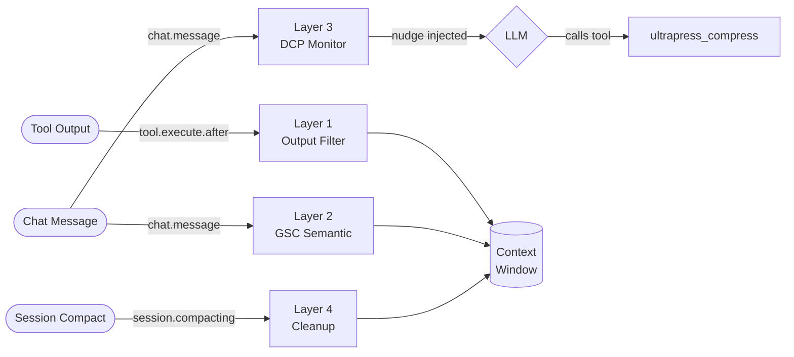

# 🚀 OpenCode UltraPress

> **Token Compression Plugin for OpenCode AI**
> Menghemat token context melalui 4 layer kompresi yang berjalan otomatis di latar belakang: Output Filtering, Semantic Compression, Dynamic Context Pruning, dan Session Cleanup.

[](https://github.com/rahadiana/opencode-ultrapress/actions/workflows/ci.yml)
[](https://www.npmjs.com/package/@ultrapress/opencode-up)
[](https://opensource.org/licenses/MIT)

---

## ⚡ Instalasi & Setup

### 1. Install Plugin

```bash
npm install -g @ultrapress/opencode-up
```

### 2. Daftarkan ke OpenCode

Tambahkan plugin ke konfigurasi OpenCode di `~/.config/opencode/config.json`:

```json
{
  "plugins": ["opencode-up"]
}
```

OpenCode akan otomatis menemukan plugin yang diinstal secara global melalui `@opencode-ai/plugin` runtime.

### 3. (Opsional) Buat Konfigurasi Personal

```bash
# Salin template ke folder konfigurasi OpenCode
cp $(npm root -g)/@ultrapress/opencode-up/ultrapress.json.example ~/.config/opencode/ultrapress.json
```

Atau biarkan saja — UltraPress akan otomatis membuat file config dengan nilai default terbaik saat pertama kali dijalankan.

### Persyaratan

| Dependency | Versi Minimum |
| :--- | :--- |
| Node.js | `>= 18` |
| OpenCode AI | Latest (uses `@opencode-ai/plugin ^1.14`) |
| `@xenova/transformers` | Hanya diperlukan jika menggunakan mode `mlm` |

---

## 🛠 Arsitektur 4-Layer

### Pipeline Flow



> Diagram teknis lengkap (termasuk error handling strategy per layer) ada di [`docs/architecture.md`](./docs/architecture.md).

---

### Layer 1 — Smart Output Filter
Mencegat output dari tool CLI sebelum masuk ke context window.
- **Domain Routing**: Filter khusus untuk `git`, `npm/node`, `pytest/jest`, dan filesystem.
- **Middle-out Truncation**: Memotong log panjang tapi tetap mempertahankan error di akhir.
- **Deduplication**: Menghapus baris log berulang secara real-time.

### Layer 2 — GSC Semantic Compression
Mengompresi teks pesan secara semantik. Layer 2 dan Layer 3 **tidak saling kompresi** — tidak ada double compression.
- **NLP Mode (Default)**: Grammar Stripping berbasis aturan linguistik, zero latency.
- **MLM Mode [EXPERIMENTAL]**: Memuat model AI lokal untuk tokenisasi yang lebih akurat. Lihat [catatan penting](#-mlm-mode-experimental).
- **Code Block Protection**: Tidak pernah menyentuh konten dalam ` ``` blocks`.

### Layer 3 — Dynamic Context Pruning (DCP)
Sistem monitoring token aktif yang memberi otonomi kepada LLM untuk mengelola memorinya.
- **Autonomous Nudge**: Memberi tahu LLM saat context window mendekati 80% batas.
- **`ultrapress_compress` Tool**: LLM dapat memanggil tool ini untuk meringkas riwayat percakapan.

### Layer 4 — Session Auto-Cleanup
- **Error Purging**: Hapus pesan error basi setelah N turn.
- **Tool-Call Dedup**: Cegah redundansi jika LLM memanggil tool sama dengan argumen identik.

---

## ⌨️ Slash Command `/up`

Ketik `/up` di chat OpenCode:

| Command | Deskripsi |
| :--- | :--- |
| `/up stats` | Dashboard statistik penghematan token sesi ini |
| `/up context` | Kapasitas memori, batas limit, sisa token |
| `/up compress` | Paksa LLM meringkas riwayat percakapan sekarang |
| `/up mode <nlp\|mlm>` | Ganti mode kompresi Layer 2 |
| `/up filter <on\|off>` | Toggle penyaringan output Layer 1 |
| `/up manual <on\|off>` | Toggle mode manual (auto-summarization mati) |

---

## ⚙️ Konfigurasi

File: `~/.config/opencode/ultrapress.json`

```json
{
  "notification": "minimal",

  "semantic": {
    "mode": "nlp",
    "model": "Xenova/distilbert-base-uncased"
  },

  "outputFilter": {
    "maxCharsPerOutput": 8000
  },

  "summarization": {
    "maxContextLimit": 70000,
    "showCompression": true
  }
}
```

Lihat [`ultrapress.json.example`](./ultrapress.json.example) untuk semua opsi yang tersedia.

---

## 🧠 MLM Mode [EXPERIMENTAL]

> [!WARNING]
> **Kejujuran teknis**: Mode MLM saat ini menggunakan model AI sebagai tokenizer yang lebih akurat, bukan untuk full semantic inference. Kompresi teks tetap menggunakan algoritma Grammar Stripping (NLP mode). Ini adalah fondasi untuk roadmap ke depan, bukan implementasi penuh.

### Model yang Tersedia

| Model ID | Ukuran | Keterangan |
| :--- | :--- | :--- |
| `Xenova/distilbert-base-uncased` | ~130MB | **Default**. Cepat, ringan, terbaik untuk Inggris. |
| `Xenova/bert-base-multilingual-uncased` | ~450MB | Mendukung 102 bahasa termasuk Indonesia. |
| `Xenova/albert-base-v2` | ~45MB | Ultra-light, cocok untuk hardware terbatas. |

### Mencari Model Lain
👉 **[Hugging Face — Transformers.js fill-mask models](https://huggingface.co/models?library=transformers.js&pipeline_tag=fill-mask)**

> [!IMPORTANT]
> Pastikan model mendukung task **`fill-mask`** agar dapat dimuat dengan benar.

### Roadmap MLM
- [ ] TF-IDF importance scoring menggunakan vocabulary model
- [ ] Sentence similarity scoring untuk dedup konteks redundan
- [ ] Extractive summarization (BertSum-style) untuk teks panjang

---

## 📊 Benchmark

Angka benchmark dihasilkan dari script yang dapat dijalankan sendiri:

```bash
npm run benchmark
```

Output aktual (dijalankan di MacBook, Node.js v22):

```
🔬 UltraPress — Reproducible Benchmark

Conditions:
  Token method : Character-based heuristic (3.7 chars/token for prose, 3.2 for code)
  Node.js      : v22.x

┌──────────────────────────┬────────────────────────────┬──────────┬────────────┬──────────┐
│Fixture                   │Layer                       │  Original│  Compressed│   Savings│
├──────────────────────────┼────────────────────────────┼──────────┼────────────┼──────────┤
│git-diff-large.txt        │Layer 1 (Git Filter)        │     1,611│         981│       39%│
│npm-install-log.txt       │Layer 1 (Generic Filter)    │       420│         420│        0%│
│pytest-log.txt            │Layer 1 (Generic Filter)    │     1,180│       1,180│        0%│
│chat-history.json         │Layer 2 (NLP Semantic)      │       625│         490│       22%│
└──────────────────────────┴────────────────────────────┴──────────┴────────────┴──────────┘

✅ Total: 3,836 → 3,071 tokens saved (20% overall savings)
```

> **Catatan**: Savings tertinggi didapat dari log CLI yang verbose (git diff: 39%). Natural language chat menghemat lebih sedikit (22%) karena konten teknis diproteksi. Dataset dan script ada di [`benchmarks/`](./benchmarks/) — jalankan sendiri untuk validasi.


---

## 🤝 Kontribusi

1. **New Filters**: Tambahkan filter Layer 1 untuk framework baru (Svelte, Flutter, Elixir, dll).
2. **MLM Roadmap**: Implementasikan TF-IDF scoring atau sentence similarity yang sebenarnya.
3. **Benchmark Dataset**: Kontribusikan fixture data dari stack teknologi Anda.
4. **UI Integration**: Tampilan statistik yang lebih interaktif di OpenCode.

```bash
git clone https://github.com/rahadiana/opencode-ultrapress.git
npm install
npm run build
npm test
npm run benchmark
```

---

## 🚀 Pengembangan Lokal

```bash
git clone https://github.com/rahadiana/opencode-ultrapress.git
cd opencode-ultrapress
npm install
npm run build    # Compile TypeScript
npm test         # Jalankan unit tests
npm run benchmark # Ukur kompresi aktual
```

---

**UltraPress** — *Because tokens are expensive, but context is priceless.* ❤️
