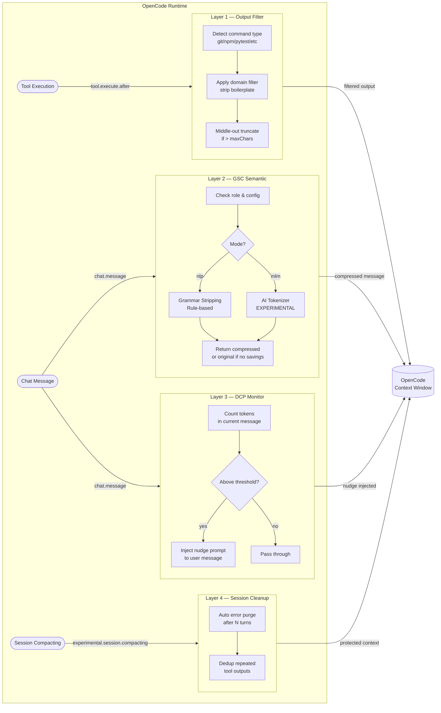

# Architecture — OpenCode UltraPress

## Pipeline Overview

Data dari setiap interaksi di OpenCode mengalir melalui 4 layer pertahanan secara berurutan. Penting: setiap layer berjalan pada **hook yang berbeda**, bukan dalam satu pipeline yang sama.

---

## Urutan Eksekusi Per Hook

### `tool.execute.after`
1. **Layer 1** — Filter output tool mentah sebelum masuk ke context window.
2. **Layer 4 (Dedup)** — Cek apakah output identik dengan sebelumnya; jika ya, hapus.

### `chat.message`
1. **Layer 3 (DCP)** — Hitung estimasi token kumulatif. Jika mendekati limit, inject nudge prompt.
2. **Layer 2 (GSC Semantic)** — Kompresi semantik pada pesan user/assistant yang lolos filter role & panjang minimum.
3. **Layer 4 (Purge)** — Tandai pesan error lama untuk dihapus setelah N turn.

### `experimental.session.compacting` _(jika OpenCode mensupport hook ini)_
- **Layer 3 (Protected Context)** — Inject ringkasan yang dilindungi agar tidak hilang saat OpenCode melakukan auto-compaction.

---

## Kenapa Tidak Ada Double Compression?

Layer 2 dan Layer 3 **tidak saling kompresi satu sama lain** karena:

1. **Layer 2** beroperasi pada **teks pesan individu** (user message atau assistant response).
2. **Layer 3** hanya **menghitung token** dan menyisipkan teks nudge baru — ia tidak mengkompresi ulang teks yang sudah ada.
3. Layer 3 mendeklarasikan `ultrapress_compress` sebagai **tool untuk LLM** (bukan auto-compression). LLM yang secara otonom memanggil tool itu, bukan sistem UltraPress.

---

## Error Handling Strategy

| Layer | Behavior Saat Error |
| :--- | :--- |
| Layer 1 | Fallback ke raw output — **tidak pernah crash** |
| Layer 2 (NLP) | Fallback ke teks asli — compression dianggap gagal, session lanjut normal |
| Layer 2 (MLM) | Fallback ke NLP mode — model gagal load, tapi session tetap jalan |
| Layer 3 | Skip nudge — tidak ada efek samping |
| Layer 4 | Skip purge — pesan lama tetap ada |

Semua layer menggunakan pola `try/catch` yang mengembalikan input asli (*passthrough*) pada kegagalan.

---

## Keterbatasan yang Diketahui

- **MLM mode** saat ini menggunakan model sebagai tokenizer yang lebih akurat, bukan untuk inferensi penuh. Ini adalah **EXPERIMENTAL** feature. Lihat [MLM Mode](#mlm-mode-experimental) di README.
- Token counting menggunakan heuristic berbasis karakter (3.7 chars/token untuk prosa), bukan `tiktoken`. Akurasi ~85-90% untuk campuran Inggris/kode.
- Hook `tool.execute.after` hanya aktif jika OpenCode memanggil tool melalui agent loop — tidak berlaku untuk pesan manual.
